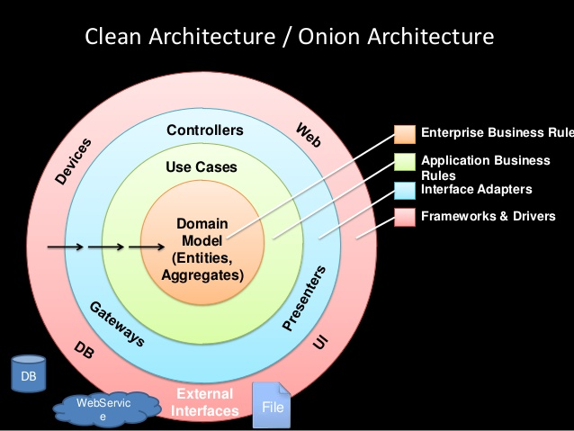

# Architecture

Software architecture refers to the fundamental structures of our starter kit app and the discipline of creating such structures and systems. Each structure comprises layers, relations among them, and properties of both layers and relations. It functions as a blueprint for the system and the developing project, laying out the tasks necessary to be executed by the design teams.

Software architecture description involves the principles and practices of modeling and representing architectures, using mechanisms such as architecture description languages, architecture viewpoints, and architecture frameworks.

Documenting software architecture facilitates communication between team members, captures early decisions about the high-level design, and allows reuse of design components between projects.

## Clean Architecture

Clean architecture is architecture based on the book and blog by Uncle Bob. It is a combination of concepts taken from the Onion Architecture and other architectures. The main focus of the architecture is separation of concerns and scalability. It consists of four main modules: App, Domain, Data, and Device.

Here you can see there are some layers and data goes from outer layer to inner layer. entity is data model class which contains all the necessary data which comes from backend API.
Use cases contains application business logic like whether we should goes to local cache or server to fetch the data. controller and presenter layer is state management layer which is bloc in our case which emits the event and yield the state from UI.

Outer layer is responsible for communication between outside of the app and our app like camera, sensor etc... Whatever data comes from this layer directly map to entity.

on the layered "onion" image below, the **horizontal arrows --->** represent dependency flow. For example, **Entities** do not depend on anything, **Use Cases** depend only on **Entities** etc.

Clean architecture is testable. The business rules can be tested without the UI, Database, Web Server, or any other external element.

Independent of UI. The UI can change easily, without changing the rest of the system. A mobile UI could be replaced with a console UI, for example, without changing the business rules.

### Dependency rules

There are many dependency injection libraries out there like `Injector`, `Kiwi`, `GetIt` and `Riverpod`.

GetIt is: (we will get the future proof, maintainable, and up-to date library)

- Extremely fast (O(1))
- Easy to learn/use
- Doesn't clutter your UI tree with special Widgets to access your data like provider or Redux does.

[More info here](https://pub.dev/packages/get_it)

On the other hand, `Riverpod` satisfies the same requirements than `GetIt` and also has:

- `FamilyProvider`s for defining providers dynamically in runtime
- `AutodisposeProvider`s for automatically removing the injected object when they are not used anymore
- `AutoDisposeFamilyProvider`s that give us the both previous functionalities at the same time

### There are four layers in this architecture:

1. Domain layer:

   The Domain module defines the business logic of the application. It is a module that is independent from the development platform i.e. it is written purely in the programming language and does not contain any elements from the platform. In the case of Flutter, Domain would be written purely in Dart without any Flutter elements. The reason for that is that Domain should only be concerned with the business logic of the application, not with the implementation details. This also allows for easy migration between platforms, should any issues arise.

2. Presentation layer:

   Presentation is the layer outside Domain. Presentation crosses the boundaries of the layers to communicate with Domain. However, the Dependency Rule is never violated. Using polymorphism, App communicates with Domain using inherited class: classes that implement or extend the Repositories present in the Domain layer. Since polymorphism is used, the Repositories passed to Domain still adhere to the Dependency Rule since as far as Domain is concerned, they are abstract. The implementation is hidden behind the polymorphism.

   We are emitting event from this layer to bloc and bloc goes to `domain` layer for further operations.

3. Data layer:

   Represents the data-layer of the application. The Data module, which is a part of the outermost layer, is responsible for data retrieval. This can be in the form of API calls to a server, a local database, or even both.

4. Device layer:

   Part of the outermost layer, Device communicates directly with the platform i.e. Android and iOS. Device is responsible for Native functionality such as GPS and other functionality present within the platform itself like the filesystem. Device calls all Native APIs.

### Pros:

- Consistent business logic through the app
- Swappable data persistence, external systems integration, and presentation
- Enables carving out a vertical feature slice into a separate service (micro service, nano service/serverless) without much difficulty
- Promotes more testable design patterns (Core business logic tends to always be testable)

### Cons:

- Requires more intentional design (you can't reference data persistence APIs directly in your business logic)
- Due to the business logic being agnostic of the outer layers you can loose optimizations in being closer to library features and implementations with the benefit of looser coupling
- Can be overkill when only a CRUD app is needed

[More info here](https://pub.dev/packages/flutter_clean_architecture)

## Clean Architecture with Domain Driven Approach and BLoC design pattern

We are using the same principles as mentioned in clean architecture section. We will follow the dependency injection rules as well.

Here we are using same layers as mentioned in clean architecture and think about domain first e.g. `Authentication`, `community` etc...

**The only difference is we have `Domain`, `Presentation`, `Data`, and `Device` layers also here with the same principle of clean architecture. We define this layers for each module/feature.** So in this way it's combination of clean architecture and domain driven design.

This architecture relies heavily on some widely-known principles, the [SOLID](https://en.wikipedia.org/wiki/SOLID) Principles, which I recommend you to have a look at. DDD says nothing about the architecture of your application. Databases, delivery such as HTTP or gRPC and controllers are not important. Here is where our two concepts combine forces for a brighter future. Using DDD to model the entities and use cases mentioned in clean architecture diagram has worked out well for us.

Conforming to these simple rules is not hard, and will save you a lot of headaches going forward. By separating the software into layers, and conforming to The Dependency Rule, you will create a system that is intrinsically testable, with all the benefits that implies. When any of the external parts of the system become obsolete, like the database, or the web framework, you can replace those obsolete elements with a minimum of fuss.

**NOTE: It should not communicate direct from presentation layer to data layer and data should not go from data layer to presentation layer directly.**

[More info here](https://mastanca.medium.com/clean-architecture-ddd-a-mixed-approach-773ab4623e14) and [here](https://blog.cleancoder.com/uncle-bob/2012/08/13/the-clean-architecture.html)

# Design Pattern

## BLoC Design Pattern

When building production quality applications, managing state becomes critical.

As developers we want to:

- know what state our application is in at any point in time.
- easily test every case to make sure our app is responding appropriately.
- record every single user interaction in our application so that we can make data-driven decisions.
- work as efficiently as possible and reuse components both within our application and across other applications.
- have many developers seamlessly working within a single code base following the same patterns and conventions.
- develop fast and reactive apps.
- Bloc was designed to meet all of these needs and many more.

There are many state management solutions and deciding which one to use can be a daunting task. There is no one perfect state management solution! What's important is that you pick the one that works best for your team and your project.

Bloc was designed with three core values in mind:

Simple: Easy to understand & can be used by developers with varying skill levels.
Powerful: Help make amazing, complex applications by composing them of smaller components.
Testable: Easily test every aspect of an application so that we can iterate with confidence.
